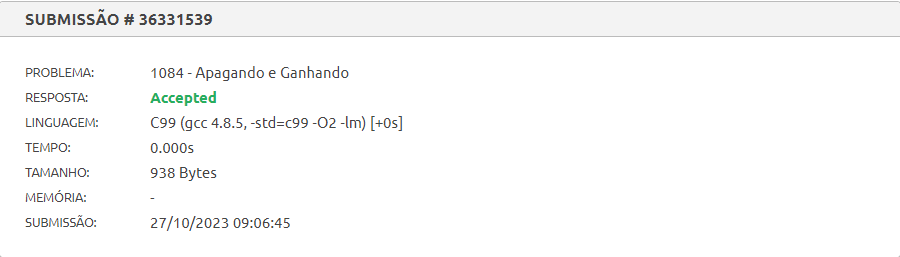
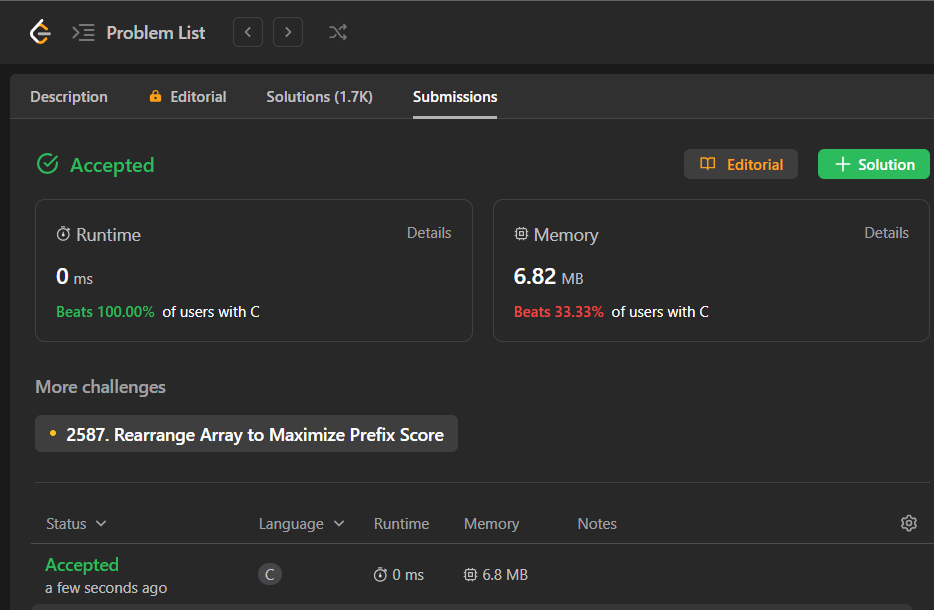
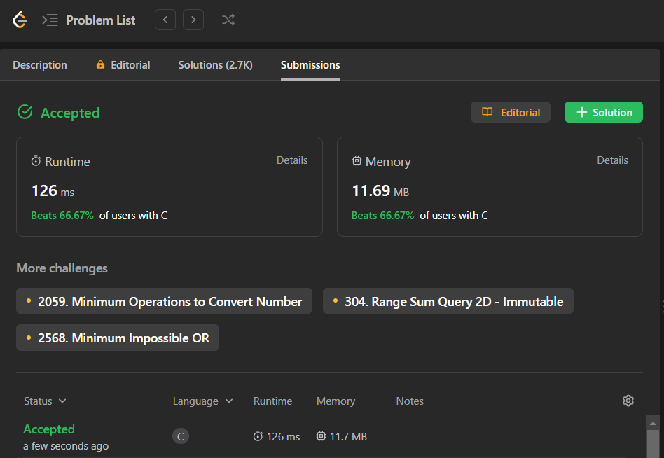
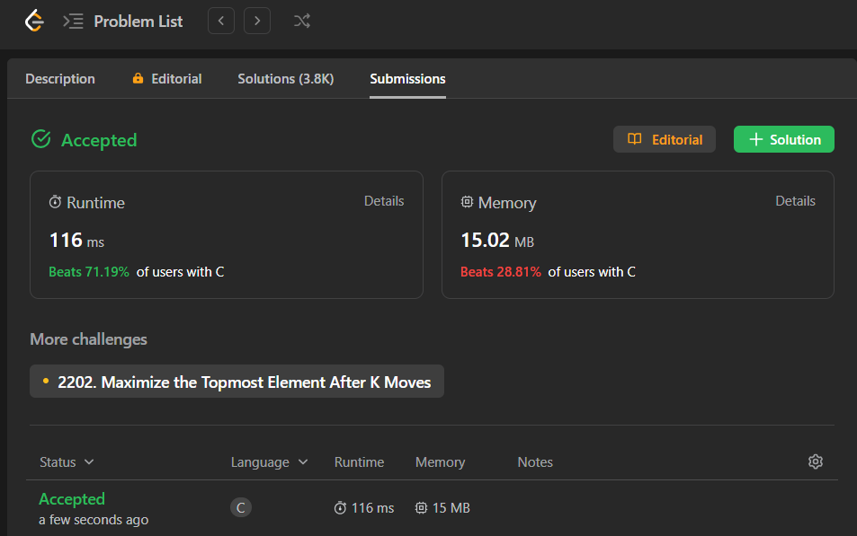

# Exercícios Resolvidos de Juiz Online

Temas:

- Greed

## Alunos

| Matrícula  | Aluno                       |
| ---------- | --------------------------- |
| 19/0085045 | Brenno da Silva Oliveira    |
| 19/0087501 | Gabriel Marcolino Rodrigues |

## Sobre

Resolução dos exercícios do Beecrowd e LeetCode.

> [1084 - Apagando e Ganhando](https://www.beecrowd.com.br/repository/UOJ_1084.html)  
> [1029 - Two City Scheduling](https://leetcode.com/problems/two-city-scheduling/)  
> [881 - Boats to Save People](https://leetcode.com/problems/boats-to-save-people/description/?envType=list&envId=50f6p33i)  
> [134 - Gas Station](https://leetcode.com/problems/gas-station/description/?envType=list&envId=50f6p33i)

## Screenshots

### 1084 - Apagando e Ganhando

### 1029 - Two City Scheduling

### 881 - Boats to Save People

### 134 - Gas Station

## Instalação

**Linguagem**: C

## Uso

Para rodar os exercícios basta clonar o respositório

    git clone git@github.com:projeto-de-algoritmos/Greed-ExerciciosJuizOnline.git

E executar os seguintes comandos dentro da pasta do arquivo pelo terminal:

    gcc -o nome_arquivo nome_arquivo.c

 

    ./nome_arquivo.exe < nome_arquivo.txt

Outra forma é subtmeter os códigos dos exercícios pelo juiz online:

- [1084 - Apagando e Ganhando](https://www.beecrowd.com.br/judge/pt/problems/view/1084)
- [1029 - Two City Scheduling](https://leetcode.com/problems/two-city-scheduling/)
- [881 - Boats to Save People](https://leetcode.com/problems/boats-to-save-people/description/?envType=list&envId=50f6p33i) 
- [134 - Gas Station](https://leetcode.com/problems/gas-station/description/?envType=list&envId=50f6p33i)

**Observação**: para os exercícios feitos no LeetCode é necessário submete-los diretamente no juiz online. 

## Outros

[Vídeo de apresentação](https://youtu.be/SWx4sa74Tkw)
